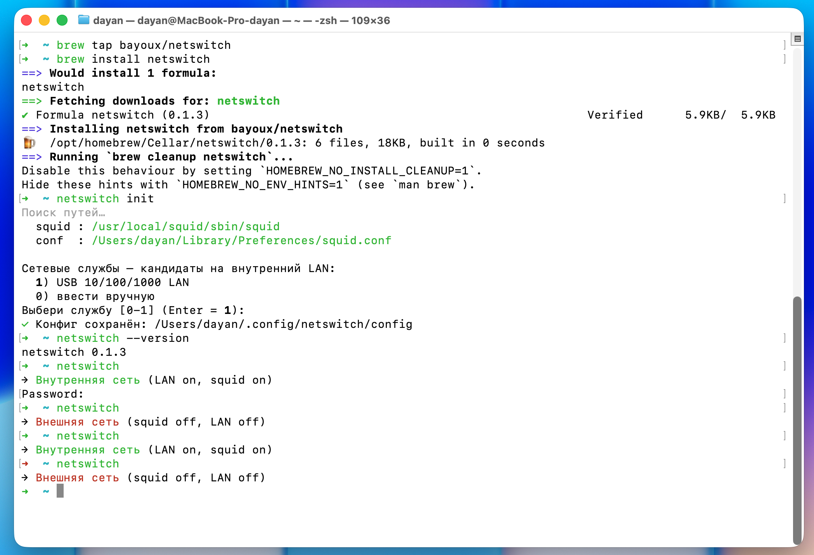

# netswitch

Переключение между внутренней и внешней сетью на macOS одной командой.

Заточено под связку **USB-LAN адаптер + локальный squid** (например, установленный через SquidMan):

| Режим | USB-LAN | squid |
|-------|---------|-------|
| Внутренняя сеть | включён | запущен (прокси доступен) |
| Внешняя сеть | выключен | остановлен |

Пути к `squid` и `squid.conf` находятся автоматически, имя сетевой службы выбирается при установке.



## Установка

### Через Homebrew (рекомендуется)

```bash
brew tap bayoux/netswitch
brew install netswitch
```

### Вручную (curl)

```bash
curl -fsSL https://raw.githubusercontent.com/bayoux/homebrew-netswitch/main/install.sh | bash
```

### Из исходников

```bash
chmod +x netswitch
sudo mv netswitch /usr/local/bin/netswitch
```

## Первый запуск

```bash
netswitch init
```

Скрипт найдёт `squid` и `squid.conf`, покажет список сетевых служб — выберите ту, что отвечает за внутреннюю сеть (USB-LAN адаптер). Всё сохранится в `~/.config/netswitch/config`.

## Команды

| Команда | Действие |
|---------|----------|
| `netswitch` | переключить сеть (toggle) |
| `netswitch init` | найти пути, выбрать службу, сохранить конфиг |
| `netswitch status` | показать текущее состояние (LAN + squid) |
| `netswitch config` | показать сохранённый конфиг |
| `netswitch --help` | справка |

## Как определяются пути

Детект выполняется один раз при `init` и кэшируется. Первое совпадение выигрывает:

| Значение | Стратегии по порядку |
|----------|----------------------|
| `SQUID` | `command -v squid` → известные пути (SquidMan, Homebrew Intel/ARM) → путь из запущенного процесса |
| `CONF` | аргумент `-f` запущенного процесса → известные пути (`~/Library/Preferences`, Homebrew, sysconfdir) → `sysconfdir` из `squid -v` |
| `SERVICE` | автоподсказка из `networksetup -listallnetworkservices` (фильтр USB/LAN/Ethernet) + подтверждение пользователем |

Если автопоиск ничего не нашёл, `init` попросит указать путь вручную.

## Конфиг

Обычный shell-файл, правится руками:

```bash
# ~/.config/netswitch/config
SERVICE="USB 10/100/1000 LAN"
SQUID="/usr/local/squid/sbin/squid"
CONF="/Users/you/Library/Preferences/squid.conf"
```

## Переключение без пароля (опционально)

`networksetup` требует прав администратора, поэтому `netswitch` спрашивает пароль. Чтобы этого избежать, добавьте правило sudo (замените `USERNAME` на вывод `whoami`):

```bash
sudo visudo -f /etc/sudoers.d/netswitch
```

```
USERNAME ALL=(ALL) NOPASSWD: /usr/sbin/networksetup -setnetworkserviceenabled *
```

## Требования

- macOS
- Установленный squid (например, через [SquidMan](https://squidman.net/) или `brew install squid`)
- `http_port` в конфиге ≥ 1024 — тогда squid запускается от вашего пользователя без `sudo`

## Лицензия

MIT — см. [LICENSE](LICENSE).
